{width="0.5236111111111111in"
height="0.5847211286089239in"}

**instructables**

{width="0.5097222222222222in"
height="0.5097211286089239in"}

> by
> {width="7.527777777777778in"
> height="0.6805555555555556in"}
>
> This is a very advantageous yet easy to make project. It prevents the
> battery from overcharging.

{width="7.477777777777778in"
height="3.738888888888889in"}

> **Step 1: Story**
>
> This is a very advantageous yet easy to make project. It prevents the
> battery from overcharging.

**This Project is named as \"..**

**Bene�ts:-**

> This device optimizes voltage di�erences and o�ers DC load
> optimization. \'It o�ers more output and hence more capacity (Amp).
> It\'s an automatic switching circuit that used to control the charging
> of a battery from any other source.
>
> This device limits the rate at which electric current is added to or
> drawn from electric batteries to protect against electrical overload,
> overcharging, and may protect against overvoltage.
>
> By following this guide, you will be able to know and make your **..**
> This project guide

contains the �les necessary to help you step by step produce your own
**..** Please follow the

> steps of the project to get a positive result.

Battery Charge Controller: Page 1

> **Step 2: Get Your PCB Ready**

**Talking about electronics**

{width="0.1388888888888889in"
height="0.1527777777777778in"}

> After making the circuit diagram I transformed it into a PCB design to
> produce it, to produce the PCB, I have chosen the best PCB supplier
> and the cheapest PCB provider to order my circuit. with
> the{width="7.527777777777778in"
> height="0.8888888888888888in"}
>
> reliable platform, all I need to do is some simple clicks to upload
> the Gerber �le and set some parameters like the PCB thickness color
> and quantity. I've paid just 2 Dollars to get my PCB after �ve days
> only, what I have noticed about this time is the \"out-of-charge PCB
> color\" which means you will pay only 2USD for any PCB color you
> choose.

**Related Download Files**

> As you can see in the pictures above the PCB is very well manufactured
> and I've got the same PCB design that we've made for our main board
> and all the labels and logos are there to guide me during the
> soldering steps. You can also download the Gerber �le for this circuit
> from the download link below in case you want to place an order for
> the same circuit design.

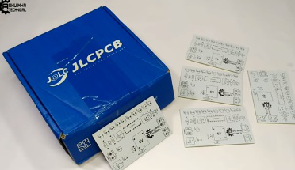{width="7.477777777777778in"
height="4.316665573053369in"}

Battery Charge Controller: Page 2

{width="7.477777777777778in"
height="4.276387795275591in"}

{width="7.477777777777778in"
height="4.098611111111111in"}

Battery Charge Controller: Page 3

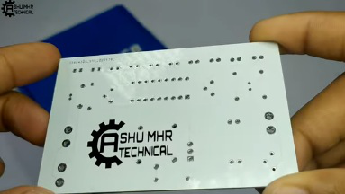{width="7.477777777777778in"
height="4.215277777777778in"}

**Step 3: Calibration**

> {width="0.1388888888888889in"
> height="0.1388888888888889in"}Firstly, We will adjust our power supply
> to 14 to 14.5 voltage to charge 12 volt battery.
>
> We can adjust our power supply in di�erent voltage for di�erent types
> of batteries.

{width="0.1388888888888889in"
height="0.1388888888888889in"}

{width="0.1388888888888889in"
height="0.1527777777777778in"}

> Now connect 14v supply instead of charger. Then slowly rotate the
> variable resistor that is beside charging point until the Red LED turn
> on.
>
> For understanding the circuit suppose this bulb is a battery. When we
> increase the voltage and the voltage just crossed to 14v. Then the
> circuit cut o� the supply to battery as result the bulb turns o�.
>
> I set 14v because most of 12 v lead acid batteries shows 14v as peak
> voltage when they become fully charged.
>
> Now reconnect the junction and connect 14 v supply instead of battery
> to the controller after that you can easily calibrate the battery
> level indicators by using these two variables resistors this function
> also works on the same principle as you can see in the pictures below
> it read the 14 v as
> 100%.{width="7.527777777777778in"
> height="0.2777777777777778in"}

Battery Charge Controller: Page 4

{width="7.477777777777778in"
height="3.6638888888888888in"}

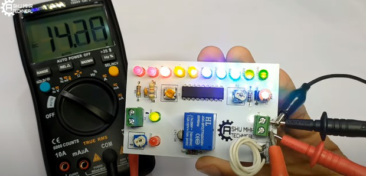{width="7.477777777777778in"
height="3.5902766841644795in"}

Battery Charge Controller: Page 5

{width="7.477777777777778in"
height="3.6027766841644793in"}

{width="7.477777777777778in"
height="3.6777777777777776in"}

Battery Charge Controller: Page 6

{width="7.477777777777778in"
height="3.5888877952755904in"}

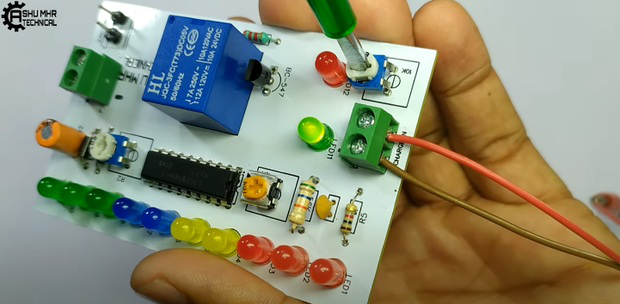{width="7.477777777777778in"
height="3.6652766841644793in"}

Battery Charge Controller: Page 7

{width="7.477777777777778in"
height="3.6027766841644793in"}

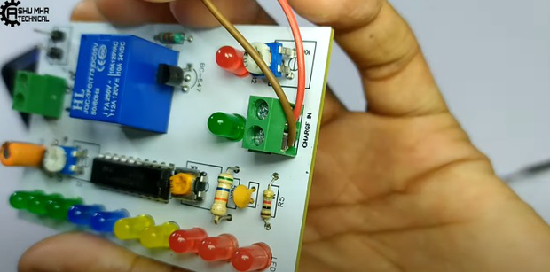{width="7.477777777777778in"
height="3.698611111111111in"}

Battery Charge Controller: Page 8

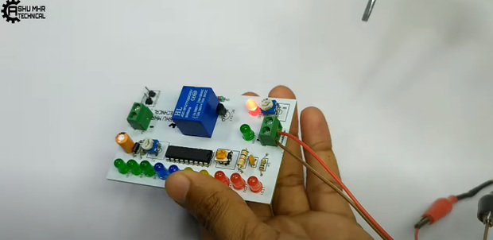{width="7.477777777777778in"
height="3.6374989063867016in"}

**Step 4: Place All the Components on PCB and Solder It Properly.**

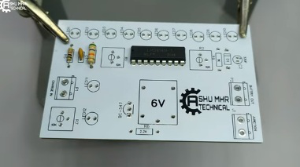{width="7.477777777777778in"
height="4.173611111111111in"}

Battery Charge Controller: Page 9

{width="7.477777777777778in"
height="4.161111111111111in"}

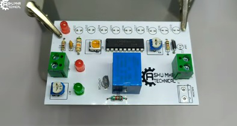{width="7.477777777777778in"
height="3.983332239720035in"}

Battery Charge Controller: Page 10

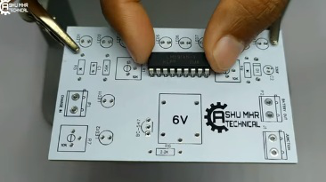{width="7.477777777777778in"
height="4.1875in"}

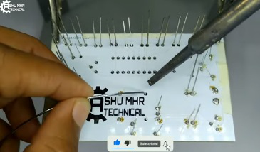{width="7.477777777777778in"
height="4.377777777777778in"}

Battery Charge Controller: Page 11

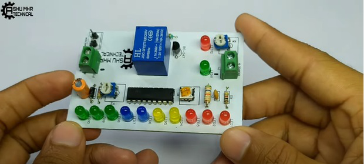{width="7.477777777777778in"
height="3.3652777777777776in"}

**Step 5: Stick the PCB in Custom Designed Box With the Help of Glue
Gun.**

{width="7.477777777777778in"
height="4.037498906386702in"}

Battery Charge Controller: Page 12

{width="7.527777777777778in"
height="0.2916666666666667in"}

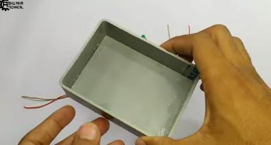{width="7.477777777777778in"
height="3.9972222222222222in"}

{width="7.477777777777778in"
height="4.187498906386701in"}

**Step 6: Cover the Box and Place All the Components of PCB on Their
Respective Holes or Places.**

> **Now your own is ready to use.**

Battery Charge Controller: Page 13

{width="7.527777777777778in"
height="0.2916666666666667in"}

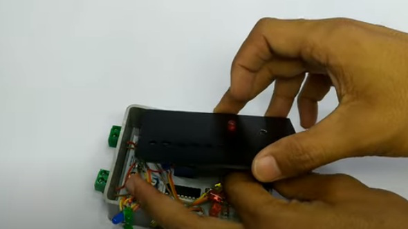{width="7.477777777777778in"
height="4.201388888888889in"}

> **Step 7: Testing**
>
> For the real time testing I am using my this 12v Lead Acid Battery to
> discharge the Battery. Here I am connecting a bulb as load to the
> battery the battery is now almost discharged to 20 % so I am
> connecting the charger to the controller in order to test overcharging
> protection system and as you can see it in photos our device works.
>
> **New users will also get some coupons while registering atvia this
> blue link.**
>
> **this guide provides full steps to help you to create your own**

Battery Charge Controller: Page 14

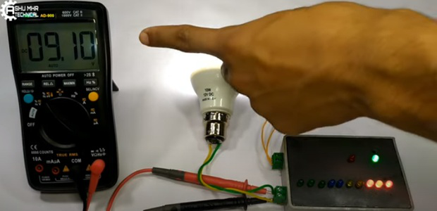{width="7.477777777777778in"
height="3.616665573053368in"}

{width="7.477777777777778in"
height="3.65in"}

Battery Charge Controller: Page 15

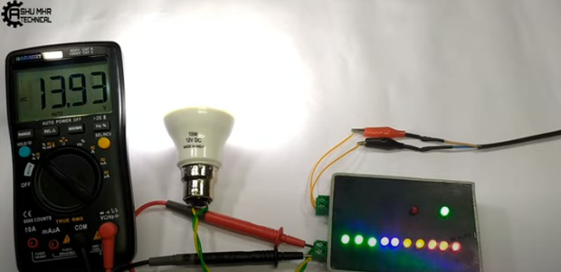{width="7.477777777777778in"
height="3.6305544619422574in"}

{width="7.477777777777778in"
height="3.5694444444444446in"}

Battery Charge Controller: Page 16

{width="7.477777777777778in"
height="3.5888877952755904in"}

{width="7.477777777777778in"
height="3.6041666666666665in"}

Battery Charge Controller: Page 17

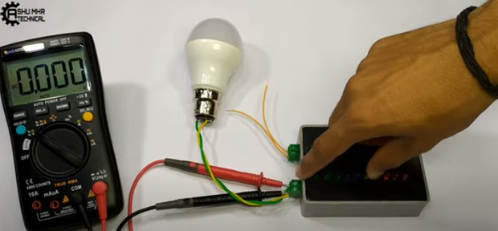{width="7.477777777777778in"
height="3.466666666666667in"}

{width="7.477777777777778in"
height="3.616665573053368in"}

Battery Charge Controller: Page 18
