>
> This is a very advantageous yet easy to make project. It prevents the
> battery from overcharging.

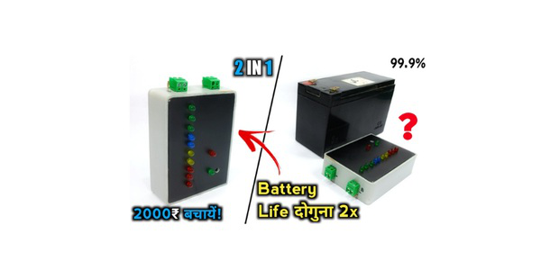

> **Step 1: Story**
>
> This is a very advantageous yet easy to make project. It prevents the
> battery from overcharging.

**This Project is named as "Battery Charge Controller".**

**Benefits:-**

> This device optimizes voltage differences and others DC load
> optimization. It offers more output and hence more capacity (Amp).
> It\'s an automatic switching circuit that used to control the charging
> of a battery from any other source.
>
> This device limits the rate at which electric current is added to or
> drawn from electric batteries to protect against electrical overload,
> overcharging, and may protect against overvoltage.
>
*By following this guide, you will be able to know and make your Battery Charge Controller. This project guide contains the files necessary to help you step by step produce your own Battery Charge Controller. Please follow the steps of the project to get a positive result.*

> **Step 2: Get Your PCB Ready**

**Talking about electronics**

> After making the circuit diagram I transformed it into a PCB design to
> produce it, to produce the PCB, I have chosen the best PCB supplier
> and the cheapest PCB provider to order my circuit. with
> the reliable platform, all I need to do is some simple clicks to upload
> the Gerber file and set some parameters like the PCB thickness color
> and quantity. I've paid just 2 Dollars to get my PCB after five days
> only, what I have noticed about this time is the "out-of-charge PCB
> color" which means you will pay only 2USD for any PCB color you choose.

**Related Download Files**

> As you can see in the pictures above the PCB is very well manufactured
> and I've got the same PCB design that we've made for our main board
> and all the labels and logos are there to guide me during the
> soldering steps. You can also download the Gerber file for this circuit
> from the download link below in case you want to place an order for
> the same circuit design.

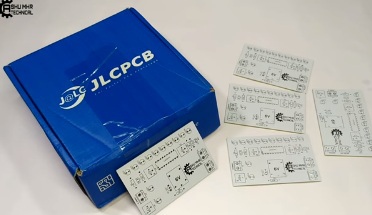
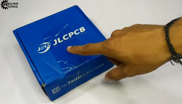
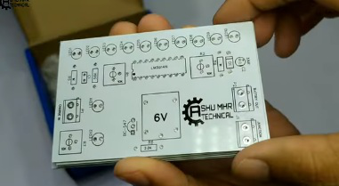
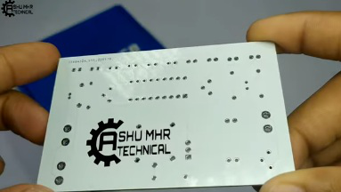

**Step 3: Calibration**

> Firstly, We will adjust our power supply
> to 14 to 14.5 voltage to charge 12 volt battery.
> 
> We can adjust our power supply in different voltage for different types of batteries.

> Now connect 14v supply instead of charger. Then slowly rotate the
> variable resistor that is beside charging point until the Red LED turn
> on.
>
> For understanding the circuit suppose this bulb is a battery. When we
> increase the voltage and the voltage just crossed to 14v. Then the
> circuit cut off the supply to battery as result the bulb turns off.
>
> I set 14v because most of 12 v lead acid batteries shows 14v as peak
> voltage when they become fully charged.
>
> Now reconnect the junction and connect 14 v supply instead of battery
> to the controller after that you can easily calibrate the battery
> level indicators by using these two variables resistors this function
> also works on the same principle as you can see in the pictures below
> it read the 14v as 100%.

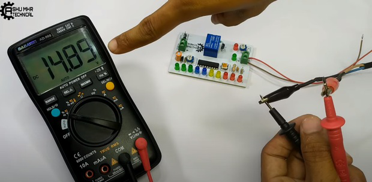
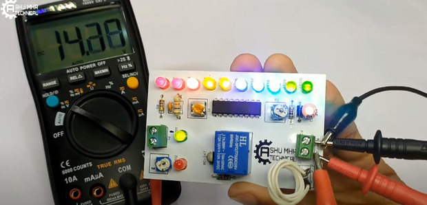
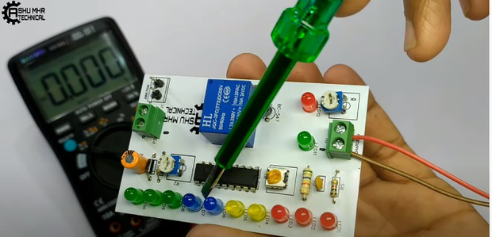
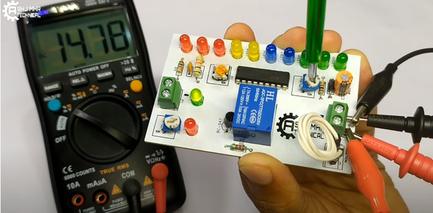
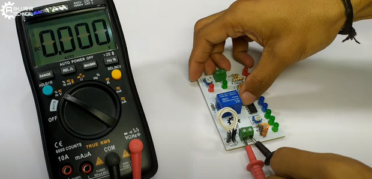
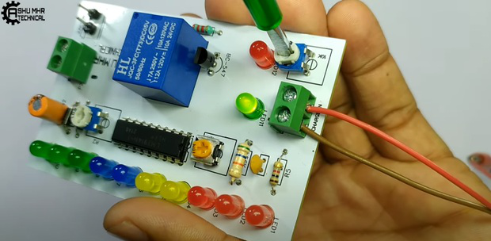
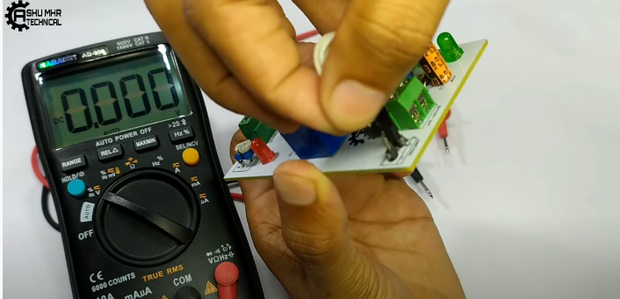
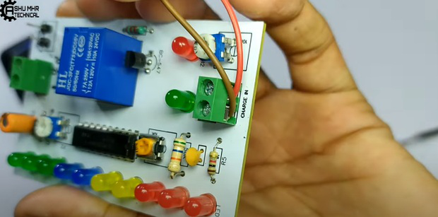
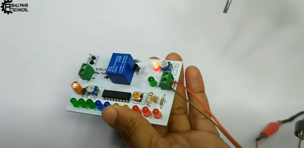

**Step 4: Place All the Components on PCB and Solder It Properly.**

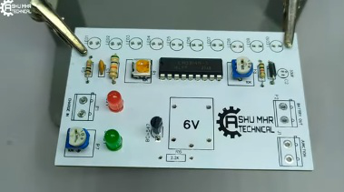

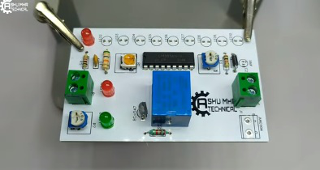

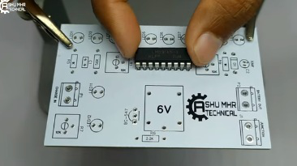

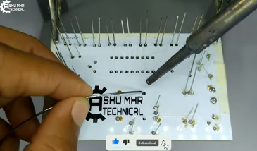

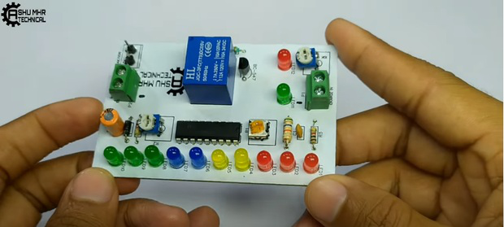

**Step 5: Stick the PCB in Custom Designed Box With the Help of Glue
Gun.**

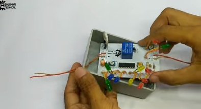
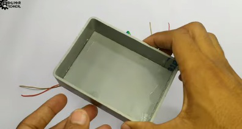

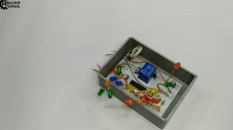

**Step 6: Cover the Box and Place All the Components of PCB on Their
Respective Holes or Places.**

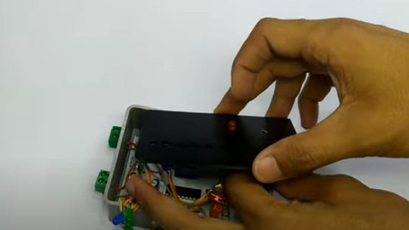
> **Now your own Battery Charge Controller is ready to use.**

> **Step 7: Testing**
>
> For the real time testing I am using my this 12v Lead Acid Battery to
> discharge the Battery. Here I am connecting a bulb as load to the
> battery the battery is now almost discharged to 20 % so I am
> connecting the charger to the controller in order to test overcharging
> protection system and as you can see it in photos our device works.

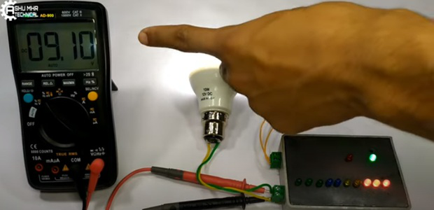
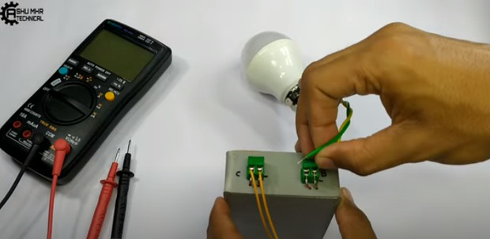
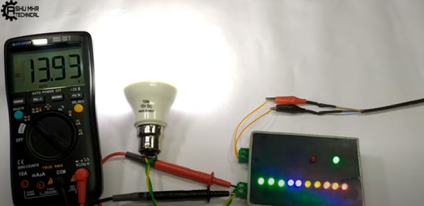
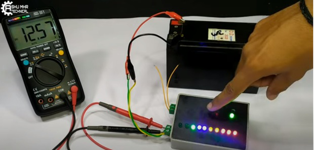
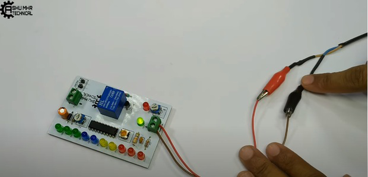
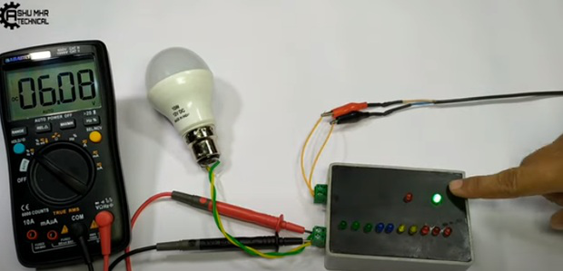
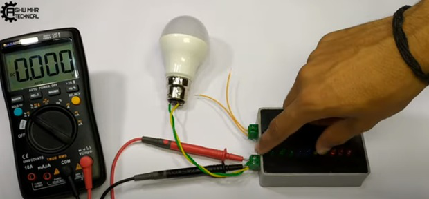
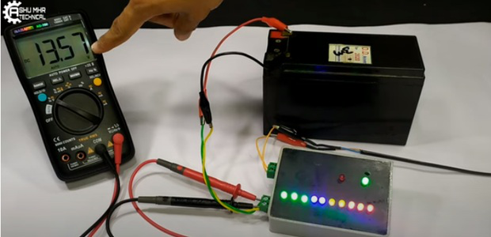

> **New users will also get some coupons while registering at JLCPCB via this
> blue link.**
>
**Thank you for reading this guide, hopefully, this guide provides full steps to help you to create your own Battery Charge Controller. If you have any questions please post them in the comment section below.**
